# Walkthrough: MERN Stack StreamingApp Deployment, Orchestration, and Scaling on AWS EKS

This guide provides step-by-step instructions for containerizing, building, and deploying the **MERN Microservices StreamingApp** to an **Amazon Elastic Kubernetes Service (EKS)** cluster. The architecture leverages **Amazon ECR** for image registries, **Jenkins** for CI/CD automation, **Helm** for orchestration, and **Amazon CloudWatch** for observability and monitoring.

---

## 🏗️ System Architecture Overview

The system runs as a multi-service application with the following components:

```mermaid
graph TD
    subgraph Developer_Workspace ["Developer Workspace"]
        LocalGit["Local Git Repo"]
    end
    
    subgraph GitHub_SaaS ["GitHub (SaaS)"]
        ForkedRepo["Forked GitHub Repo"]
    end

    subgraph AWS_CI ["AWS CI Environment"]
        EC2_Jenkins["Jenkins EC2 Instance"]
        DockerBuild["Docker Engine (Image Build)"]
    end

    subgraph AWS_Registry ["AWS Registry"]
        ECR_FE["ECR: streaming-app-frontend"]
        ECR_Auth["ECR: streaming-app-auth"]
        ECR_Stream["ECR: streaming-app-streaming"]
        ECR_Admin["ECR: streaming-app-admin"]
        ECR_Chat["ECR: streaming-app-chat"]
    end

    subgraph AWS_EKS ["Amazon EKS Cluster (Kubernetes)"]
        subgraph K8s_Namespace ["Namespace: streaming-app"]
            HelmRelease["Helm Release"]
            
            subgraph FE_Group ["Frontend Application"]
                FE_Service["Frontend Service (LoadBalancer)"]
                FE_Pods["Frontend Pods (React + Nginx Proxy)"]
            end
            
            subgraph Auth_Group ["Auth Microservice"]
                Auth_Service["Auth Service (ClusterIP: 3001)"]
                Auth_Pods["Auth Pods (Node.js)"]
            end
            
            subgraph Stream_Group ["Streaming Microservice"]
                Stream_Service["Streaming Service (ClusterIP: 3002)"]
                Stream_Pods["Streaming Pods (Node.js)"]
            end

            subgraph Admin_Group ["Admin Microservice"]
                Admin_Service["Admin Service (ClusterIP: 3003)"]
                Admin_Pods["Admin Pods (Node.js)"]
            end

            subgraph Chat_Group ["Chat Microservice"]
                Chat_Service["Chat Service (ClusterIP: 3004)"]
                Chat_Pods["Chat Pods (Node.js)"]
            end
            
            subgraph DB_Group ["Database Service"]
                DB_Service["MongoDB Service (ClusterIP: 27017)"]
                DB_Pod["MongoDB Pod (StatefulSet / Deployment)"]
            end
        end
    end

    subgraph AWS_Management ["AWS Operations & Observability"]
        CloudWatch["Amazon CloudWatch"]
        CW_Logs["CloudWatch Logs"]
        CW_Alarms["Alarms (CPU/Memory)"]
        SNS_Topic["Amazon SNS Topic"]
    end

    subgraph Messaging ["Messaging Channel"]
        Slack["Slack / Telegram Chat Notification"]
    end

    ForkedRepo -->|"Clone / Push"| LocalGit
    LocalGit -->|"Webhook Trigger"| EC2_Jenkins
    EC2_Jenkins -->|"Pull Code"| DockerBuild
    DockerBuild -->|"Push Auth"| ECR_Auth
    DockerBuild -->|"Push Streaming"| ECR_Stream
    DockerBuild -->|"Push Admin"| ECR_Admin
    DockerBuild -->|"Push Chat"| ECR_Chat
    DockerBuild -->|"Push Frontend"| ECR_FE
    
    HelmRelease -->|"Deploy"| FE_Service
    FE_Service --> FE_Pods
    HelmRelease -->|"Deploy"| Auth_Service
    Auth_Service --> Auth_Pods
    HelmRelease -->|"Deploy"| Stream_Service
    Stream_Service --> Stream_Pods
    HelmRelease -->|"Deploy"| Admin_Service
    Admin_Service --> Admin_Pods
    HelmRelease -->|"Deploy"| Chat_Service
    Chat_Service --> Chat_Pods
    HelmRelease -->|"Deploy"| DB_Service
    DB_Service --> DB_Pod
 
    FE_Pods -->|"/api/auth -> internal proxy"| Auth_Service
    FE_Pods -->|"/api/streaming -> internal proxy"| Stream_Service
    FE_Pods -->|"/api/admin -> internal proxy"| Admin_Service
    FE_Pods -->|"/api/chat -> internal proxy"| Chat_Service
    FE_Pods -->|"/socket.io -> WebSocket proxy"| Chat_Service

    Auth_Pods -->|"Read/Write"| DB_Service
    Stream_Pods -->|"Read/Write"| DB_Service
    Admin_Pods -->|"Read/Write"| DB_Service
    Chat_Pods -->|"Read/Write"| DB_Service

    FE_Pods -->|"Send Logs & Metrics"| CloudWatch
    Auth_Pods -->|"Send Logs & Metrics"| CloudWatch
    Stream_Pods -->|"Send Logs & Metrics"| CloudWatch
    Admin_Pods -->|"Send Logs & Metrics"| CloudWatch
    Chat_Pods -->|"Send Logs & Metrics"| CloudWatch
    CloudWatch --> CW_Logs
    CloudWatch --> CW_Alarms
    CW_Alarms -->|"Trigger Alert"| SNS_Topic
    SNS_Topic -->|"Alert Notification"| Slack
```



---

## 🛠️ Step-by-Step Implementation Guide

---

### Step 1: Local Development & Verification (Docker Compose)
Before deploying anything to AWS, ensure the microservices build and function properly on your local environment using the configured Docker Compose environment.

1. **Navigate to the cloned repository:**
   ```bash
   cd d:\HeroVired\Assignments\Orchestration_Scaling_Demo\StreamingApp
   ```
2. **Configure Local Environment Variables:**
   Although the `docker-compose.yml` provides default fallbacks that allow the app to boot up immediately for basic offline testing, you should create a local `.env` file to support full service capabilities (like AWS S3 storage for video assets):
   - Copy `.env.example` to `.env`:
     ```bash
     copy .env.example .env
     ```
   - Open the `.env` file and populate it with your settings (JWT secrets, DB name, and AWS credentials/S3 bucket details if you want to test streaming).
3. **Start the local Docker Compose stack:**
   ```bash
   docker-compose up --build -d
   ```
4. **Verify running containers:**
   ```bash
   docker ps
   ```
   You should see 6 containers running: `mongo`, `auth`, `streaming`, `admin`, `chat`, and `frontend`.
4. **Access the application locally:**
   - Open your browser and navigate to `http://localhost:3000`.
   - Test basic flows like registering an account and signing in.
5. **Shut down the local stack:**
   ```bash
   docker-compose down
   ```

---

### Step 2: Nginx Reverse Proxy Configuration & Frontend Updates
In a Kubernetes cluster, exposing every backend microservice publicly via an AWS LoadBalancer is expensive and exposes multiple public endpoints, leading to CORS issues. 

Instead, we configure the **Frontend container's Nginx** to act as a **Reverse Proxy**. The React client will send all API requests to relative paths (e.g., `/api/auth`, `/api/streaming`), and Nginx routes them internally to the respective Kubernetes Services.

1. **Create the Nginx configuration file:**
   Inside `frontend/`, create a new file named `nginx.conf` and paste the following content:
   
   ```nginx
   server {
       listen 80;
       server_name localhost;

       location / {
           root /usr/share/nginx/html;
           index index.html index.htm;
           try_files $uri $uri/ /index.html;
       }

       # Proxy /api/auth requests to the internal auth-service
       location /api/auth/ {
           proxy_pass http://auth-service:3001/api/;
           proxy_http_version 1.1;
           proxy_set_header Upgrade $http_upgrade;
           proxy_set_header Connection 'upgrade';
           proxy_set_header Host $host;
           proxy_cache_bypass $http_upgrade;
       }

       # Proxy /api/streaming requests to the internal streaming-service
       location /api/streaming/ {
           proxy_pass http://streaming-service:3002/api/;
           proxy_http_version 1.1;
           proxy_set_header Upgrade $http_upgrade;
           proxy_set_header Connection 'upgrade';
           proxy_set_header Host $host;
           proxy_cache_bypass $http_upgrade;
       }

       # Proxy /api/admin requests to the internal admin-service
       location /api/admin/ {
           proxy_pass http://admin-service:3003/api/admin/;
           proxy_http_version 1.1;
           proxy_set_header Upgrade $http_upgrade;
           proxy_set_header Connection 'upgrade';
           proxy_set_header Host $host;
           proxy_cache_bypass $http_upgrade;
       }

       # Proxy /api/chat requests to the internal chat-service
       location /api/chat/ {
           proxy_pass http://chat-service:3004/api/chat/;
           proxy_http_version 1.1;
           proxy_set_header Upgrade $http_upgrade;
           proxy_set_header Connection 'upgrade';
           proxy_set_header Host $host;
           proxy_cache_bypass $http_upgrade;
       }

       # Proxy Socket.io websocket connections to the internal chat-service
       location /socket.io/ {
           proxy_pass http://chat-service:3004/socket.io/;
           proxy_http_version 1.1;
           proxy_set_header Upgrade $http_upgrade;
           proxy_set_header Connection "Upgrade";
           proxy_set_header Host $host;
           proxy_cache_bypass $http_upgrade;
       }
   }
   ```

2. **Update the Frontend `Dockerfile` (`frontend/Dockerfile`):**
   Open `frontend/Dockerfile` and modify it to copy your new `nginx.conf` into the container. Ensure it looks like this:
   
   ```dockerfile
   FROM node:18-alpine AS build
   WORKDIR /app
   COPY package*.json ./
   RUN npm install
   COPY . .

   ARG REACT_APP_AUTH_API_URL
   ARG REACT_APP_STREAMING_API_URL
   ARG REACT_APP_STREAMING_PUBLIC_URL
   ARG REACT_APP_ADMIN_API_URL
   ARG REACT_APP_CHAT_API_URL
   ARG REACT_APP_CHAT_SOCKET_URL

   ENV REACT_APP_AUTH_API_URL=${REACT_APP_AUTH_API_URL}
   ENV REACT_APP_STREAMING_API_URL=${REACT_APP_STREAMING_API_URL}
   ENV REACT_APP_STREAMING_PUBLIC_URL=${REACT_APP_STREAMING_PUBLIC_URL}
   ENV REACT_APP_ADMIN_API_URL=${REACT_APP_ADMIN_API_URL}
   ENV REACT_APP_CHAT_API_URL=${REACT_APP_CHAT_API_URL}
   ENV REACT_APP_CHAT_SOCKET_URL=${REACT_APP_CHAT_SOCKET_URL}

   RUN npm run build

   FROM nginx:1.27-alpine AS production
   COPY --from=build /app/build /usr/share/nginx/html
   # Copy custom Nginx configuration to enable proxy routing
   COPY nginx.conf /etc/nginx/conf.d/default.conf
   EXPOSE 80
   CMD ["nginx", "-g", "daemon off;"]
   ```

---

### Step 3: AWS Setup & Amazon ECR Repositories

Configure your AWS environment locally and create repositories for each component to store build images.

1. **Configure your AWS CLI:**
   Retrieve your AWS Access Key, Secret Key, and Session Token from your AWS Learner Lab console, then configure the AWS CLI:
   ```bash
   aws configure
   ```
   Provide your AWS credentials and set the default region to `us-east-1`.

2. **Create 5 ECR Repositories:**
   Run the following commands to initialize the registry:
   ```bash
   aws ecr create-repository --repository-name streaming-app-auth --region us-east-1
   aws ecr create-repository --repository-name streaming-app-streaming --region us-east-1
   aws ecr create-repository --repository-name streaming-app-admin --region us-east-1
   aws ecr create-repository --repository-name streaming-app-chat --region us-east-1
   aws ecr create-repository --repository-name streaming-app-frontend --region us-east-1
   ```

3. **Verify ECR Repositories:**
   List the repositories in your console or CLI to confirm creation:
   ```bash
   aws ecr describe-repositories --region us-east-1
   ```

---

### Step 4: Continuous Integration (CI) with Jenkins

Instead of building and pushing images manually, configure a Jenkins pipeline to automate the build-and-push flow to ECR on commits.

1. **Log in to Jenkins:**
   Access the centralized Jenkins portal at **`https://jenkinsacademics.herovired.com/`** using your user credentials.
   
2. **Add AWS Credentials to Jenkins:**
   - Go to **Manage Jenkins** -> **Credentials** -> **System** -> **Global credentials (unrestricted)** -> **Add Credentials**.
   - **Credential 1 (AWS API keys):**
     - Kind: **AWS Credentials** (or configured as environment variables)
     - ID: `HV-B16A-TB-AWS-CREDENTIALS`
     - Access Key ID: *Your AWS Access Key*
     - Secret Access Key: *Your AWS Secret Key*
   - **Credential 2 (AWS Account ID):**
     - Kind: **Secret text**
     - ID: `HV-B16A-TB-AWS-ACCOUNT-ID`
     - Secret: *Your AWS Account ID* (e.g., `123456789012`)
   - **Credential 3 (AWS Region):**
     - Kind: **Secret text**
     - ID: `HV-B16A-TB-AWS-DEFAULT-REGION`
     - Secret: `us-east-1`

3. **Create the `Jenkinsfile`:**
   In the root of your `StreamingApp` directory, create a `Jenkinsfile` containing the pipeline details. Note the different Docker build contexts and build arguments for the frontend:
   
   ```groovy
   pipeline {
       agent any
       environment {
           FRONTEND_IMAGE = "streaming-app-frontend"
           AUTH_IMAGE = "streaming-app-auth"
           STREAMING_IMAGE = "streaming-app-streaming"
           ADMIN_IMAGE = "streaming-app-admin"
           CHAT_IMAGE = "streaming-app-chat"
       }
       stages {
           stage('Checkout Code') {
               steps {
                   checkout scm
               }
           }
           
           stage('AWS ECR Login & Push') {
               steps {
                   // Bind AWS Credentials, Account ID, and Default Region from Jenkins Credentials vault
                   withCredentials([
                       string(credentialsId: 'HV-B16A-TB-AWS-ACCOUNT-ID', variable: 'AWS_ACCOUNT_ID'),
                       string(credentialsId: 'HV-B16A-TB-AWS-DEFAULT-REGION', variable: 'AWS_DEFAULT_REGION'),
                       [$class: 'AmazonWebServicesCredentialsBinding', credentialsId: 'HV-B16A-TB-AWS-CREDENTIALS']
                   ]) {
                       script {
                           def ecrRegistry = "${AWS_ACCOUNT_ID}.dkr.ecr.${AWS_DEFAULT_REGION}.amazonaws.com"
                           
                           // Log in to AWS ECR
                           sh "aws ecr get-login-password --region ${AWS_DEFAULT_REGION} | docker login --username AWS --password-stdin ${ecrRegistry}"
                           
                           // 1. Build and Push Auth Service (Context: backend/authService)
                           sh "docker build -t ${AUTH_IMAGE}:${BUILD_NUMBER} -f backend/authService/Dockerfile backend/authService"
                           sh "docker tag ${AUTH_IMAGE}:${BUILD_NUMBER} ${ecrRegistry}/${AUTH_IMAGE}:${BUILD_NUMBER}"
                           sh "docker tag ${AUTH_IMAGE}:${BUILD_NUMBER} ${ecrRegistry}/${AUTH_IMAGE}:latest"
                           sh "docker push ${ecrRegistry}/${AUTH_IMAGE}:${BUILD_NUMBER}"
                           sh "docker push ${ecrRegistry}/${AUTH_IMAGE}:latest"
                           
                           // 2. Build and Push Streaming Service (Context: backend)
                           sh "docker build -t ${STREAMING_IMAGE}:${BUILD_NUMBER} -f backend/streamingService/Dockerfile backend"
                           sh "docker tag ${STREAMING_IMAGE}:${BUILD_NUMBER} ${ecrRegistry}/${STREAMING_IMAGE}:${BUILD_NUMBER}"
                           sh "docker tag ${STREAMING_IMAGE}:${BUILD_NUMBER} ${ecrRegistry}/${STREAMING_IMAGE}:latest"
                           sh "docker push ${ecrRegistry}/${STREAMING_IMAGE}:${BUILD_NUMBER}"
                           sh "docker push ${ecrRegistry}/${STREAMING_IMAGE}:latest"
                           
                           // 3. Build and Push Admin Service (Context: backend)
                           sh "docker build -t ${ADMIN_IMAGE}:${BUILD_NUMBER} -f backend/adminService/Dockerfile backend"
                           sh "docker tag ${ADMIN_IMAGE}:${BUILD_NUMBER} ${ecrRegistry}/${ADMIN_IMAGE}:${BUILD_NUMBER}"
                           sh "docker tag ${ADMIN_IMAGE}:${BUILD_NUMBER} ${ecrRegistry}/${ADMIN_IMAGE}:latest"
                           sh "docker push ${ecrRegistry}/${ADMIN_IMAGE}:${BUILD_NUMBER}"
                           sh "docker push ${ecrRegistry}/${ADMIN_IMAGE}:latest"
                           
                           // 4. Build and Push Chat Service (Context: backend)
                           sh "docker build -t ${CHAT_IMAGE}:${BUILD_NUMBER} -f backend/chatService/Dockerfile backend"
                           sh "docker tag ${CHAT_IMAGE}:${BUILD_NUMBER} ${ecrRegistry}/${CHAT_IMAGE}:${BUILD_NUMBER}"
                           sh "docker tag ${CHAT_IMAGE}:${BUILD_NUMBER} ${ecrRegistry}/${CHAT_IMAGE}:latest"
                           sh "docker push ${ecrRegistry}/${CHAT_IMAGE}:${BUILD_NUMBER}"
                           sh "docker push ${ecrRegistry}/${CHAT_IMAGE}:latest"
                           
                           // 5. Build and Push Frontend (Context: frontend, with relative proxy build variables)
                           sh "docker build -t ${FRONTEND_IMAGE}:${BUILD_NUMBER} " +
                              "--build-arg REACT_APP_AUTH_API_URL=/api/auth " +
                              "--build-arg REACT_APP_STREAMING_API_URL=/api/streaming " +
                              "--build-arg REACT_APP_STREAMING_PUBLIC_URL=/api/streaming " +
                              "--build-arg REACT_APP_ADMIN_API_URL=/api/admin " +
                              "--build-arg REACT_APP_CHAT_API_URL=/api/chat " +
                              "--build-arg REACT_APP_CHAT_SOCKET_URL=/ " +
                              "-f frontend/Dockerfile frontend"
                           sh "docker tag ${FRONTEND_IMAGE}:${BUILD_NUMBER} ${ecrRegistry}/${FRONTEND_IMAGE}:${BUILD_NUMBER}"
                           sh "docker tag ${FRONTEND_IMAGE}:${BUILD_NUMBER} ${ecrRegistry}/${FRONTEND_IMAGE}:latest"
                           sh "docker push ${ecrRegistry}/${FRONTEND_IMAGE}:${BUILD_NUMBER}"
                           sh "docker push ${ecrRegistry}/${FRONTEND_IMAGE}:latest"
                       }
                   }
               }
           }
       }
       post {
           always {
               // Clean up unused docker images to save disk space on Jenkins builder
               sh "docker image prune -f"
           }
       }
   }
   ```

4. **Set Up a Jenkins Pipeline Job:**
   - Create a **New Item** -> Name it `StreamingApp-Pipeline` -> Choose **Pipeline** -> OK.
   - Under **Build Triggers**, select **GitHub hook trigger for GITScm polling** to automate builds on git push.
   - Under **Pipeline** section, set **Definition** to `Pipeline script from SCM`.
   - Set **SCM** to `Git`, and paste your repository link.
   - Specify the branch to build (e.g., `*/main`).
   - Click **Save** and click **Build Now** to perform a test build. Verify ECR repositories receive the images.

---

### Step 5: AWS Kubernetes (EKS) Cluster Provisioning

Use the tool `eksctl` to set up your managed Kubernetes cluster.

1. **Deploy EKS Cluster:**
   Run the following command to deploy a cluster of 2 `t3.medium` instances inside `us-east-1`. (Note: This process takes 15-20 minutes).
   ```bash
   eksctl create cluster \
     --name streaming-app-cluster \
     --region us-east-1 \
     --nodegroup-name workers \
     --node-type t3.medium \
     --nodes 2 \
     --managed
   ```

2. **Verify CLI connectivity to cluster:**
   ```bash
   kubectl get nodes
   ```
   You should see 2 ready nodes listed in the console.

---

### Step 6: App Orchestration via Helm Charts

Deploying standard `.yaml` files manually is complex. We utilize a **Helm Chart** to parameterize configurations and deploy the stack.

1. **Create the Helm directory structure:**
   At the root of the repository, create a directory called `helm/` and add subdirectories/files:
   ```bash
   mkdir -p helm/templates
   ```

2. **Create `helm/Chart.yaml`:**
   Add metadata about your application:
   ```yaml
   apiVersion: v2
   name: streaming-app
   description: A Helm chart to deploy MERN Microservices on Amazon EKS
   type: application
   version: 1.0.0
   appVersion: "1.0.0"
   ```

3. **Create `helm/values.yaml`:**
   Add default configuration values. Replace `<YOUR_AWS_ACCOUNT_ID>` with your AWS Account ID:
   ```yaml
   replicaCount: 2

   awsAccountId: "<YOUR_AWS_ACCOUNT_ID>"
   awsRegion: "us-east-1"

   # AWS configurations for S3 video streaming and uploads
   aws:
     accessKeyId: "<YOUR_AWS_ACCESS_KEY_ID>"
     secretAccessKey: "<YOUR_AWS_SECRET_ACCESS_KEY>"
     region: "us-east-1"
     s3Bucket: "<YOUR_AWS_S3_BUCKET_NAME>"
     cdnUrl: ""

   mongodb:
     image: mongo
     tag: 6.0
     port: 27017
     uri: "mongodb://mongodb-service:27017/streamingapp"

   authService:
     image: streaming-app-auth
     tag: latest
     port: 3001

   streamingService:
     image: streaming-app-streaming
     tag: latest
     port: 3002

   adminService:
     image: streaming-app-admin
     tag: latest
     port: 3003

   chatService:
     image: streaming-app-chat
     tag: latest
     port: 3004

   frontend:
     image: streaming-app-frontend
     tag: latest
     port: 80
   ```

4. **Define Kubernetes Resources inside templates folder:**
   Create individual YAML configuration manifests inside `helm/templates/`.

   ##### 1. **MongoDB StatefulSet** (`helm/templates/mongodb.yaml`):
   ```yaml
   apiVersion: apps/v1
   kind: Deployment
   metadata:
     name: mongodb-deployment
     namespace: default
   spec:
     replicas: 1
     selector:
       matchLabels:
         app: mongodb
     template:
       metadata:
         labels:
           app: mongodb
       spec:
         containers:
           - name: mongodb
             image: "{{ .Values.mongodb.image }}:{{ .Values.mongodb.tag }}"
             ports:
               - containerPort: {{ .Values.mongodb.port }}
             volumeMounts:
               - name: mongo-storage
                 mountPath: /data/db
         volumes:
           - name: mongo-storage
             emptyDir: {}
   ---
   apiVersion: v1
   kind: Service
   metadata:
     name: mongodb-service
     namespace: default
   spec:
     ports:
       - port: {{ .Values.mongodb.port }}
         targetPort: {{ .Values.mongodb.port }}
     selector:
       app: mongodb
   ```

   ##### 2. **Auth Service** (`helm/templates/auth.yaml`):
   ```yaml
   apiVersion: apps/v1
   kind: Deployment
   metadata:
     name: auth-deployment
     namespace: default
   spec:
     replicas: {{ .Values.replicaCount }}
     selector:
       matchLabels:
         app: auth-service
     template:
       metadata:
         labels:
           app: auth-service
       spec:
         containers:
           - name: auth-service
             image: "{{ .Values.awsAccountId }}.dkr.ecr.{{ .Values.awsRegion }}.amazonaws.com/{{ .Values.authService.image }}:{{ .Values.authService.tag }}"
             ports:
               - containerPort: {{ .Values.authService.port }}
             env:
               - name: PORT
                 value: "{{ .Values.authService.port }}"
               - name: MONGO_URI
                 value: "{{ .Values.mongodb.uri }}"
               - name: JWT_SECRET
                 value: "changeme"
               - name: AWS_ACCESS_KEY_ID
                 value: "{{ .Values.aws.accessKeyId }}"
               - name: AWS_SECRET_ACCESS_KEY
                 value: "{{ .Values.aws.secretAccessKey }}"
               - name: AWS_REGION
                 value: "{{ .Values.aws.region }}"
               - name: AWS_S3_BUCKET
                 value: "{{ .Values.aws.s3Bucket }}"
   ---
   apiVersion: v1
   kind: Service
   metadata:
     name: auth-service
     namespace: default
   spec:
     ports:
       - port: {{ .Values.authService.port }}
         targetPort: {{ .Values.authService.port }}
     selector:
       app: auth-service
   ```

   ##### 3. **Streaming Service** (`helm/templates/streaming.yaml`):
   ```yaml
   apiVersion: apps/v1
   kind: Deployment
   metadata:
     name: streaming-deployment
     namespace: default
   spec:
     replicas: {{ .Values.replicaCount }}
     selector:
       matchLabels:
         app: streaming-service
     template:
       metadata:
         labels:
           app: streaming-service
       spec:
         containers:
           - name: streaming-service
             image: "{{ .Values.awsAccountId }}.dkr.ecr.{{ .Values.awsRegion }}.amazonaws.com/{{ .Values.streamingService.image }}:{{ .Values.streamingService.tag }}"
             ports:
               - containerPort: {{ .Values.streamingService.port }}
             env:
               - name: PORT
                 value: "{{ .Values.streamingService.port }}"
               - name: MONGO_URI
                 value: "{{ .Values.mongodb.uri }}"
               - name: JWT_SECRET
                 value: "changeme"
               - name: AWS_ACCESS_KEY_ID
                 value: "{{ .Values.aws.accessKeyId }}"
               - name: AWS_SECRET_ACCESS_KEY
                 value: "{{ .Values.aws.secretAccessKey }}"
               - name: AWS_REGION
                 value: "{{ .Values.aws.region }}"
               - name: AWS_S3_BUCKET
                 value: "{{ .Values.aws.s3Bucket }}"
               - name: AWS_CDN_URL
                 value: "{{ .Values.aws.cdnUrl }}"
               - name: STREAMING_PUBLIC_URL
                 value: "/api/streaming"
   ---
   apiVersion: v1
   kind: Service
   metadata:
     name: streaming-service
     namespace: default
   spec:
     ports:
       - port: {{ .Values.streamingService.port }}
         targetPort: {{ .Values.streamingService.port }}
     selector:
       app: streaming-service
   ```

   ##### 4. **Admin Service** (`helm/templates/admin.yaml`):
   ```yaml
   apiVersion: apps/v1
   kind: Deployment
   metadata:
     name: admin-deployment
     namespace: default
   spec:
     replicas: {{ .Values.replicaCount }}
     selector:
       matchLabels:
         app: admin-service
     template:
       metadata:
         labels:
           app: admin-service
       spec:
         containers:
           - name: admin-service
             image: "{{ .Values.awsAccountId }}.dkr.ecr.{{ .Values.awsRegion }}.amazonaws.com/{{ .Values.adminService.image }}:{{ .Values.adminService.tag }}"
             ports:
               - containerPort: {{ .Values.adminService.port }}
             env:
               - name: PORT
                 value: "{{ .Values.adminService.port }}"
               - name: MONGO_URI
                 value: "{{ .Values.mongodb.uri }}"
               - name: JWT_SECRET
                 value: "changeme"
               - name: AWS_ACCESS_KEY_ID
                 value: "{{ .Values.aws.accessKeyId }}"
               - name: AWS_SECRET_ACCESS_KEY
                 value: "{{ .Values.aws.secretAccessKey }}"
               - name: AWS_REGION
                 value: "{{ .Values.aws.region }}"
               - name: AWS_S3_BUCKET
                 value: "{{ .Values.aws.s3Bucket }}"
               - name: AWS_CDN_URL
                 value: "{{ .Values.aws.cdnUrl }}"
   ---
   apiVersion: v1
   kind: Service
   metadata:
     name: admin-service
     namespace: default
   spec:
     ports:
       - port: {{ .Values.adminService.port }}
         targetPort: {{ .Values.adminService.port }}
     selector:
       app: admin-service
   ```

   ##### 5. **Chat Service** (`helm/templates/chat.yaml`):
   ```yaml
   apiVersion: apps/v1
   kind: Deployment
   metadata:
     name: chat-deployment
     namespace: default
   spec:
     replicas: {{ .Values.replicaCount }}
     selector:
       matchLabels:
         app: chat-service
     template:
       metadata:
         labels:
           app: chat-service
       spec:
         containers:
           - name: chat-service
             image: "{{ .Values.awsAccountId }}.dkr.ecr.{{ .Values.awsRegion }}.amazonaws.com/{{ .Values.chatService.image }}:{{ .Values.chatService.tag }}"
             ports:
               - containerPort: {{ .Values.chatService.port }}
             env:
               - name: PORT
                 value: "{{ .Values.chatService.port }}"
               - name: MONGO_URI
                 value: "{{ .Values.mongodb.uri }}"
               - name: JWT_SECRET
                 value: "changeme"
   ---
   apiVersion: v1
   kind: Service
   metadata:
     name: chat-service
     namespace: default
   spec:
     ports:
       - port: {{ .Values.chatService.port }}
         targetPort: {{ .Values.chatService.port }}
     selector:
       app: chat-service
   ```

   ##### 6. **Frontend Router & Service** (`helm/templates/frontend.yaml`):
   ```yaml
   apiVersion: apps/v1
   kind: Deployment
   metadata:
     name: frontend-deployment
     namespace: default
   spec:
     replicas: {{ .Values.replicaCount }}
     selector:
       matchLabels:
         app: frontend
     template:
       metadata:
         labels:
           app: frontend
       spec:
         containers:
           - name: frontend
             image: "{{ .Values.awsAccountId }}.dkr.ecr.{{ .Values.awsRegion }}.amazonaws.com/{{ .Values.frontend.image }}:{{ .Values.frontend.tag }}"
             ports:
               - containerPort: {{ .Values.frontend.port }}
   ---
   apiVersion: v1
   kind: Service
   metadata:
     name: frontend-service
     namespace: default
   spec:
     type: LoadBalancer
     ports:
       - port: 80
         targetPort: {{ .Values.frontend.port }}
     selector:
       app: frontend
   ```

5. **Linter & Install Stack:**
   Validate details and deploy the Helm chart:
   ```bash
   # Lint configurations
   helm lint ./helm
   
   # Dry-run validation
   helm install streaming-app ./helm --dry-run
   
   # Run full installation
   helm upgrade --install streaming-app ./helm
   ```

6. **Verify EKS Resources:**
   ```bash
   kubectl get all
   ```
   Confirm all deployments, services, replicasets, and pods are running correctly.

---

### Step 7: CloudWatch Container Insights, Monitoring, and Logging

Verify logging configurations to centralize application observability and monitoring.

1. **Associate IAM OIDC Provider:**
   Enable IAM integrations for EKS components:
   ```bash
   eksctl utils associate-iam-oidc-provider --cluster streaming-app-cluster --approve
   ```

2. **Deploy CloudWatch Agent and Fluent Bit:**
   Apply the CloudWatch Container Insights quick-start configuration, which automatically sets up a DaemonSet streaming log files located in `/var/log/containers` to AWS CloudWatch Log Groups:
   ```bash
   kubectl apply -f https://raw.githubusercontent.com/aws-samples/amazon-cloudwatch-container-insights/latest/k8s-deployment-manifest-templates/deployment-mode/daemonset/container-insights-monitoring/quickstart/cwagent-fluent-bit-quickstart.yaml
   ```

3. **Verify Logging in AWS Console:**
   - Navigate to AWS CloudWatch -> **Log Groups**.
   - You should see a group named `/aws/containerinsights/streaming-app-cluster/application`.
   - Open standard output and standard error logs generated by pods (like `auth`, `streaming`, and `frontend`) to check functionality.

4. **Create CPU/Memory Utilization Alarms:**
   - Under CloudWatch -> **Alarms** -> **Create Alarm**.
   - Select the EKS Cluster Node metric `node_cpu_utilization`.
   - Set the condition: Threshold `Static`, trigger if metric is `Greater than 80%` for 5 minutes.
   - Configure notification triggers to dispatch to an Amazon SNS topic.

---

### Step 8: ChatOps Integration (Bonus)

Deploy real-time alerts so that operations engineers get warnings in their chat application whenever cluster states change.

1. **Create an SNS Topic:**
   ```bash
   aws sns create-topic --name streaming-app-alerts --region us-east-1
   ```
   Save the returned `TopicArn`.

2. **Configure Chat Alert Relay:**
   - Option A: **AWS Chatbot** (Native integration for Slack/Chime).
   - Option B: **AWS Lambda Forwarder** (Useful for Telegram, MS Teams, or Discord).
     - Create a simple Node.js or Python Lambda function subscribing to your SNS Topic.
     - Have the function forward the payload parsed from the SNS body to your custom Webhook URL:
       ```javascript
       const axios = require('axios');
       exports.handler = async (event) => {
           const message = event.Records[0].Sns.Message;
           await axios.post('YOUR_WEBHOOK_URL', { text: `🚨 Alert: ${message}` });
       };
       ```
3. **Link Alarm to SNS:**
   Under your CloudWatch Alarm's **Actions** panel, select the `streaming-app-alerts` SNS Topic as the notification target for state changes (`ALARM`).

---

### Step 9: Final Deployment Verification

1. **Retrieve the LoadBalancer Public DNS Name:**
   ```bash
   kubectl get service frontend-service
   ```
   Look at the `EXTERNAL-IP` field. It should look like `a66xxx...us-east-1.elb.amazonaws.com`.

2. **Access and Verify in Browser:**
   - Paste the external DNS URL into your web browser.
   - Verify that the React page renders properly.
   - Create a test account (uses the auth microservice).
   - Navigate sections and verify web page elements are fully operational.

---

## 📸 Final Deliverables Checklist (For Project Submission)

Ensure you capture screenshots of the following deliverables to attach to your submission report:

1. **GitHub Setup:** Terminal showing `git remote -v` verifying upstream sync configuration.
2. **ECR Registry:** AWS Console ECR repositories showing images built and pushed with `latest` and `${BUILD_NUMBER}` tags.
3. **Jenkins Dashboard:** Screen showing successful pipeline execution details.
4. **Kubernetes Resources:** Terminal view of `kubectl get all` showing all cluster objects.
5. **Active LoadBalancer:** React interface rendering on the AWS Classic LoadBalancer public DNS address.
6. **CloudWatch Log Group:** Logs page on AWS showing standard out streams.
7. **ChatOps Alarm:** Message in your Slack/Telegram channel showing triggered alerts.
